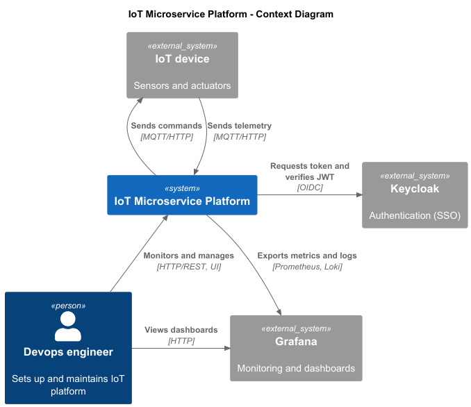
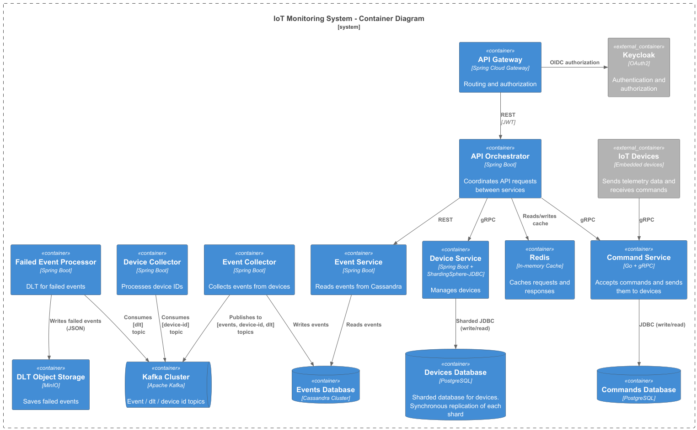

# IoT Platform

## Architecture Overview

The IoT Platform is a demo project featuring microservice architecture for IoT.

The platform consists of the following components:

- **Data Storage**: PostgreSQL, Redis, Cassandra, MinIO
- **Messaging**: Kafka with Schema Registry
- **Authentication/Authorization**: Keycloak
- **Business Process Management**: Camunda BPM
- **Observability**: Prometheus, Grafana

## Context Diagram



## Container Diagram



## Project Structure

```plaintext
ourcode-iot-platform/
├── architecture/
│   ├── diagrams/                    # C4 diagrams
│   │   ├── image/                   # Images generated from PlantUML
│   │   ├── containers.puml
│   │   └── context.puml
│   └── infrastructure/
│       ├── db/                      # Database initialization scripts
│       ├── observability/
│       │   ├── grafana/       
│       │   │   ├── dashboards/      # Grafana dashboards 
│       │   │   └── provisioning/    # Grafana provisioning files
│       │   └── prometheus.yaml      # Prometheus configuration
│       ├── .env.example             # Example environment variables
│       ├── docker-compose.yaml    
│       └── Makefile                # Makefile for managing the platform
├── .gitignore              
└── README.md            
```

## Setup Instructions

### Prerequisites

- Git
- Docker
- (Optional) Switch to Linux terminal to run make commands if you're on Windows

### Starting the Platform

Clone the repository

```bash
git clone git@github.com:ds-usova/ourcode-iot-platform.git
```

Create a `.env` file and override the default environment variables if needed.

```bash
cd ./architecture/infrastructure; cp .env.example .env
```

#### Configure Nexus

Nexus is automatically configured through the init-nexus.sh script:

* To start Nexus, run the following command:

```bash
make start-nexus
```

* Make sure Nexus container is running and healthy.
* The repository `iot-libs-release-local` will be automatically created.
* You can access Nexus UI at [http://localhost:8081](http://localhost:8081) with credentials `admin:NEXUS_PASSWORD`.

#### Publish Libraries to Nexus

* Publish libraries to Nexus:

```bash
make publish-libraries
```

* Open [Avro-schemas in Nexus](http://localhost:8081/#browse/browse:iot-libs-release-local)
* Make sure the libraries are published

#### Start the platform

* Start all services:

```bash
make up
```

* Make sure all services are healthy
* You can also check some of the urls below to verify that the services are running correctly.

#### Stop the platform

```bash
make down
```

## Service URLs

| Service         | URL                                                                                      | Credentials                               |
|-----------------|------------------------------------------------------------------------------------------|-------------------------------------------|
| Grafana         | [http://localhost:3000/dashboards](http://localhost:3000/dashboards)                     | GRAFANA_ADMIN_USER:GRAFANA_ADMIN_PASSWORD |
| Redis Insight   | [http://localhost:5540](http://localhost:5540)                                           | N/A                                       |
| Schema registry | [http://localhost:8086/subjects](http://localhost:8086/subjects)                         | N/A                                       |
| Kafka UI        | [http://localhost:8082](http://localhost:8082)                                           | N/A                                       |
| Keycloak        | [http://localhost:8083](http://localhost:8083)                                           | KEYCLOAK_ADMIN:KEYCLOAK_ADMIN_PASSWORD    |
| Camunda         | [http://localhost:8084/camunda/app/cockpit/](http://localhost:8084/camunda/app/cockpit/) | demo:demo                                 |
| MinIO Console   | [http://localhost:9001](http://localhost:9001)                                           | MINIO_ROOT_USER:MINIO_ROOT_PASSWORD       |
| Prometheus      | [http://localhost:9090](http://localhost:9090)                                           | N/A                                       |
| Nexus           | [http://localhost:8081](http://localhost:8081)                                           | admin:NEXUS_PASSWORD                      |
