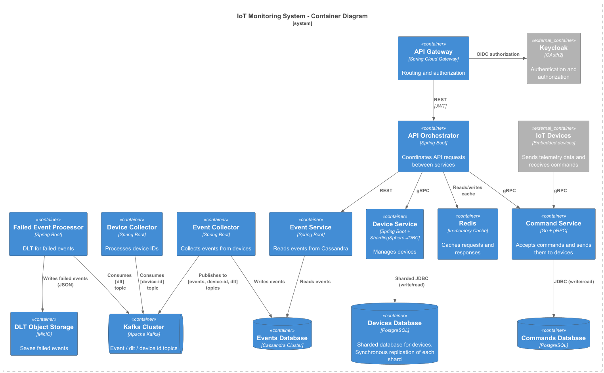

# IoT Platform

## Architecture Overview

The IoT Platform is a demo project featuring microservice architecture for IoT.

The platform consists of the following components:

- **Data Storage**: PostgreSQL, Redis, Cassandra, MinIO
- **Messaging**: Kafka with Schema Registry
- **Authentication/Authorization**: Keycloak
- **Business Process Management**: Camunda BPM
- **Observability**: Prometheus, Grafana

## Context Diagram


## Container Diagram



## Project Structure

```plaintext
ourcode-iot-platform/
├── architecture/
│   ├── diagrams/                    # C4 diagrams
│   │   ├── image/                   # Images generated from PlantUML
│   │   ├── containers.puml
│   │   └── context.puml
│   └── infrastructure/
│       ├── db/                      # Database initialization scripts
│       ├── observability/
│       │   ├── grafana/       
│       │   │   ├── dashboards/      # Grafana dashboards 
│       │   │   └── provisioning/    # Grafana provisioning files
│       │   └── prometheus.yaml      # Prometheus configuration
│       ├── .env.example             # Example environment variables
│       ├── docker-compose.yaml    
│       └── Makefile                # Makefile for managing the platform
├── .gitignore              
└── README.md            
```

## Setup Instructions

### Prerequisites

- Git
- Docker

### Starting the Platform

Clone the repository

```bash
git clone git@github.com:ds-usova/ourcode-iot-platform.git
```

Create a `.env` file and override the default environment variables if needed.

```bash
cd ./architecture/infrastructure; cp .env.example .env
```

Start the platform using Docker Compose and make sure all services are healthy. You can also check some of the urls
below to verify that the services are running correctly.

```bash
docker-compose up -d
```

To stop all services:

```bash
docker-compose down
```

## Service URLs

| Service         | URL                                                                                      | Credentials                               |
|-----------------|------------------------------------------------------------------------------------------|-------------------------------------------|
| Grafana         | [http://localhost:3000](http://localhost:3000)                                           | GRAFANA_ADMIN_USER:GRAFANA_ADMIN_PASSWORD |
| Redis Insight   | [http://localhost:5540](http://localhost:5540)                                           | N/A                                       |
| Schema registry | [http://localhost:8081/subjects](http://localhost:8081/subjects)                         | N/A                                       |
| Kafka UI        | [http://localhost:8082](http://localhost:8082)                                           | N/A                                       |
| Keycloak        | [http://localhost:8083](http://localhost:8083)                                           | KEYCLOAK_ADMIN:KEYCLOAK_ADMIN_PASSWORD    |
| Camunda         | [http://localhost:8084/camunda/app/cockpit/](http://localhost:8084/camunda/app/cockpit/) | demo:demo                                 |
| MinIO Console   | [http://localhost:9001](http://localhost:9001)                                           | MINIO_ROOT_USER:MINIO_ROOT_PASSWORD       |
| Prometheus      | [http://localhost:9090](http://localhost:9090)                                           | N/A                                       |
