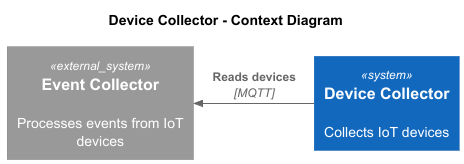
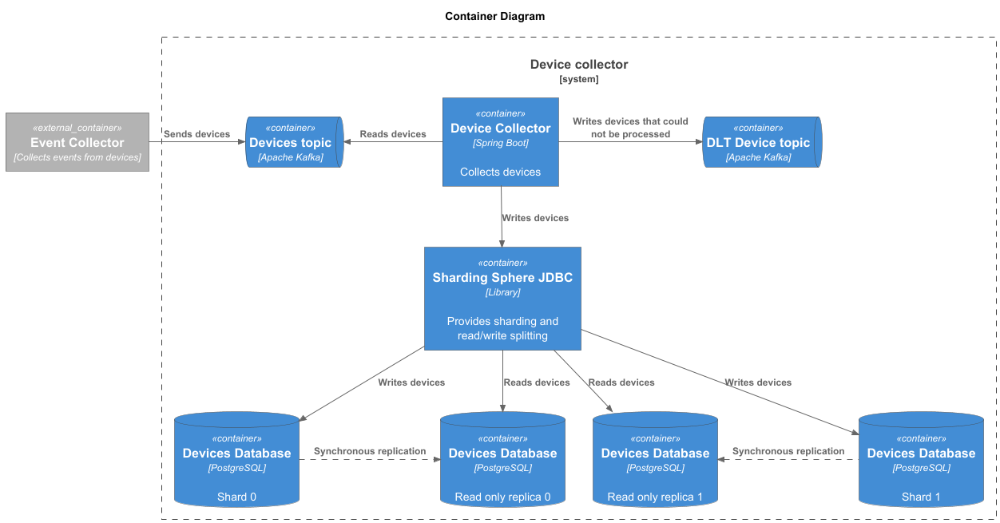
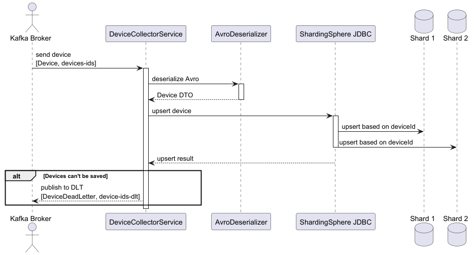

# Device Collector

## Architecture Overview

Device Collector is a microservice designed to collect and process data from various IoT devices. It ingests data through Kafka topics, processes the information, and stores it in a PostgreSQL database.

The service consists of the following components:

- **Data Storage**: PostgreSQL database (two shards with read replicas), Sharding Sphere JDBC
- **Messaging**: Kafka with Schema Registry
- **Observability**: Prometheus, Grafana

## Context Diagram



## Container Diagram



## Device Processing Flow



## Project Structure
```plaintext
device-collector/
├── architecture/
│   ├── diagrams/                    # C4 diagrams
│   │   ├── image/                   # Images generated from PlantUML
│   │   ├── consume-device-flow.puml
│   │   ├── containers.puml
│   │   └── context.puml
│   └── src/main/
│       ├── java/
│       │   ├── api/                 # Service API (doesn't depend on any other layers)
│       │   │   ├── events/          # Application events
│       │   │   ├── exception/
│       │   │   ├── gateway/         # Gateway interfaces (data providers/consumers)
│       │   │   ├── model/           # Model classes
│       │   │   └── service/         # Business logic interfaces
│       │   ├── application/         # Business logic implementations
│       │   ├── kafka/               
│       │   ├── metrics/               
│       │   ├── persistence/               
│       │   └── DeviceCollectorApplication.java
│       └── resources/
└── README.md
```

## Setup Instructions

### Prerequisites

- Git
- Docker
- Install Kafka plugin for your IDE (e.g., IntelliJ IDEA)
- (Optional) Switch to Linux terminal to run make commands if you're on Windows

### Starting the Platform

{Todo}

### Plans

{Todo}