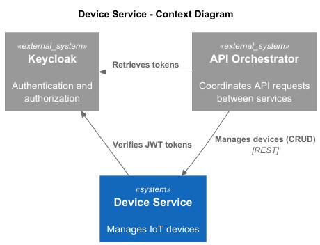
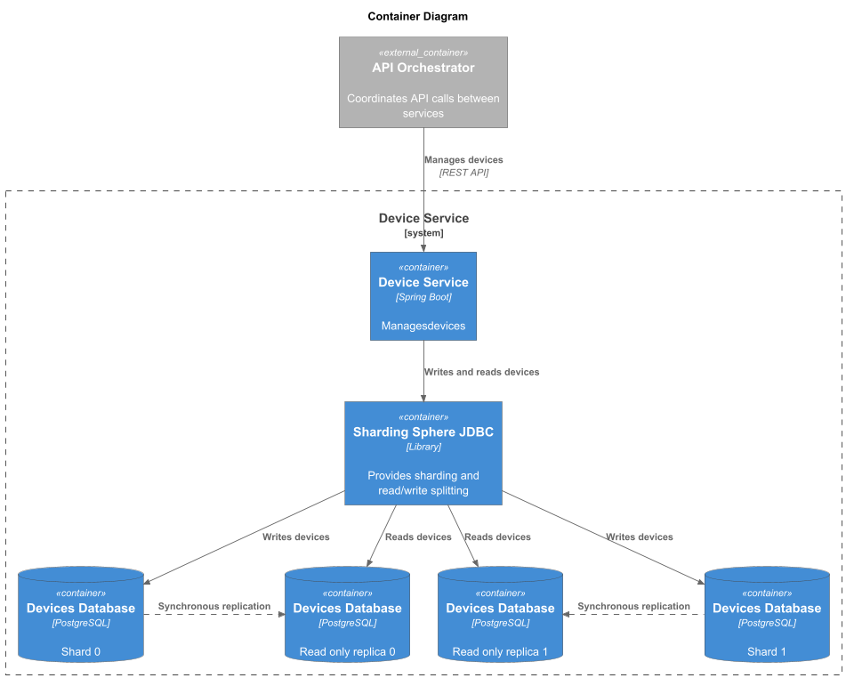
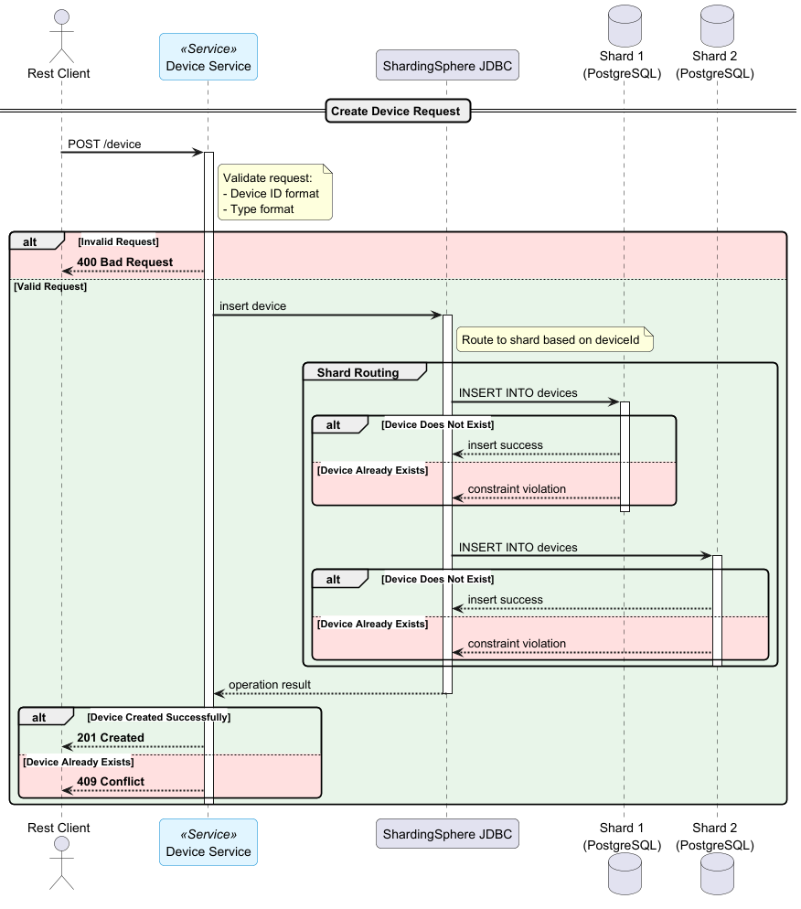

# Device Service

## Architecture Overview

Device Service is a CRUD service for managing IoT devices.

The service consists of the following components:

- **Data Storage**: PostgreSQL database (two shards with read replicas), Sharding Sphere JDBC
- **Observability**: Prometheus, Grafana
- **Security**: Keycloak

## Context Diagram



## Container Diagram



## Create Device Sequence Diagram



## Project Structure

```plaintext
device-service/
├── architecture/
│   ├── diagrams/                       # C4 diagrams
│   │   ├── image/                      # Images generated from PlantUML
│   │   ├── containers-diagram.puml   
│   │   ├── context-diagram.puml   
│   │   └── create-device-flow.puml   
│   └── src/main/   
│       ├── java/   
│       │   ├── api/                    # Service API (doesn't depend on any other layers)
│       │   │   ├── exception/   
│       │   │   ├── gateway/            # Gateway interfaces (data providers/consumers)
│       │   │   ├── model/              # Model classes
│       │   │   └── service/            # Business logic interfaces
│       │   ├── application/            # Business logic implementations
│       │   ├── metrics/               
│       │   ├── persistence/               
│       │   ├── rest/               
│       │   ├── util/               
│       │   └── DeviceServiceApplication.java
│       └── resources/
└── README.md
```

## Roles

API is protected by Keycloak, which provides the following roles:
- device-reader - can read devices
- device-writer - can read, create, update, and delete devices

Mock clients has been set up in keycloak for testing purposes.
Credentials can be found in [src/test/resources/http/http-client.env.json](src/test/resources/http/http-client.env.json)

When running the service inside Docker container, DEVICE_SERVICE_API_PROTECTED environment variable is set to "false", which means that the service is not protected by Keycloak.

## Setup Instructions

### Prerequisites

- Git
- Docker
- Create Artifactory repository (see README in root folder)
- (Optional) Switch to Linux terminal to run make commands if you're on Windows

### Starting the Platform

To start local environment with PostgreSQL, run:

```bash
cd ..
make start-env-device-service
```

To start the Device Service, run:

```bash
cd ..
make start-device-service
```

To start Device Service with observability tools (Prometheus and Grafana), run:

```bash
cd ..
make start-service-collector observability
```

### Smoke Test

* Start the Device Service (make start-device-service) and ensure it is running
* Open [src/test/resources/http/requests.http](src/test/resources/http/requests.http)
* Select "no-auth" environment
* Send one of the requests, e.g. "Create a device"
* Check the response (should be 201 Created)