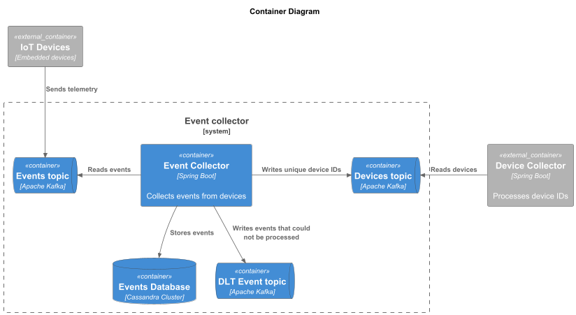

# Event Collector

## Architecture Overview

The Event Collector collects event data from IoT devices, processes it, and stores it in a database for further analysis.

The service consists of the following components:

- **Data Storage**: Cassandra
- **Messaging**: Kafka with Schema Registry
- **Observability**: Prometheus, Grafana

## Context Diagram


## Container Diagram



## Event Processing Flow


## Project Structure

```plaintext
event-collector/
├── architecture/
│   ├── diagrams/                    # C4 diagrams
│   │   ├── image/                   # Images generated from PlantUML
│   │   ├── containers.puml
│   │   └── context.puml
│   └── src/main/
│       ├── avro/                    # Avro schemas
│       ├── java/
│       │   ├── api/                 # Service API (doesn't depend on any other layers)
│       │   │   ├── exception/
│       │   │   ├── gateway/         # Gateway interfaces (data providers/consumers)
│       │   │   ├── model/           # Model classes
│       │   │   └── service/         # Business logic interfaces
│       │   ├── application/         # Business logic implementations
│       │   ├── cache/               
│       │   ├── cassandra/           
│       │   ├── kafka/               
│       │   └── EventCollectorApplication.java
│       └── resources/
└── README.md
```

## Setup Instructions

### Prerequisites

- Git
- Docker
- Install Kafka plugin for your IDE (e.g., IntelliJ IDEA)
- (Optional) Switch to Linux terminal to run make commands if you're on Windows

### Starting the Platform

1. Open the infrastructure directory:
```bash
cd ../architecture/infrastructure
```
2. Start the required services:
```bash
make start-env-event-collector
```

3. Create schemas in Schema Registry with Kafka plugin (see src/main/avro).
4. Start the Event Collector service.
5. Make sure all services are healthy. 

You can also send a test event with Kafka 
plugin to verify that the service is working correctly. If there is a device 
published to device-ids topic, the service is working correctly.

### Plans

- Automate schema creation
- Replace in-memory cache, as it is not suitable for production use
- Potentially use an outbox table to ensure devices are published
- Use env variables for configuration in application.yaml instead of hardcoding values
- Configure logging and monitoring
- Add tests when kafka has high latency
- Add CI/CD pipeline