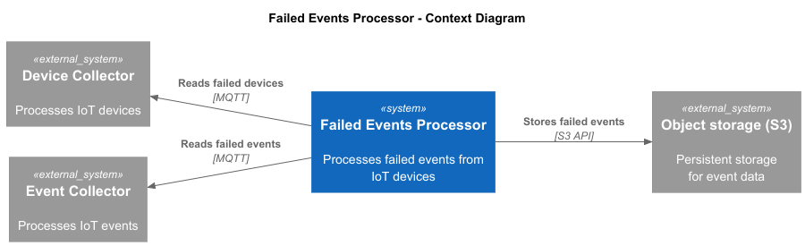
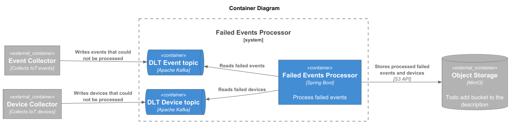
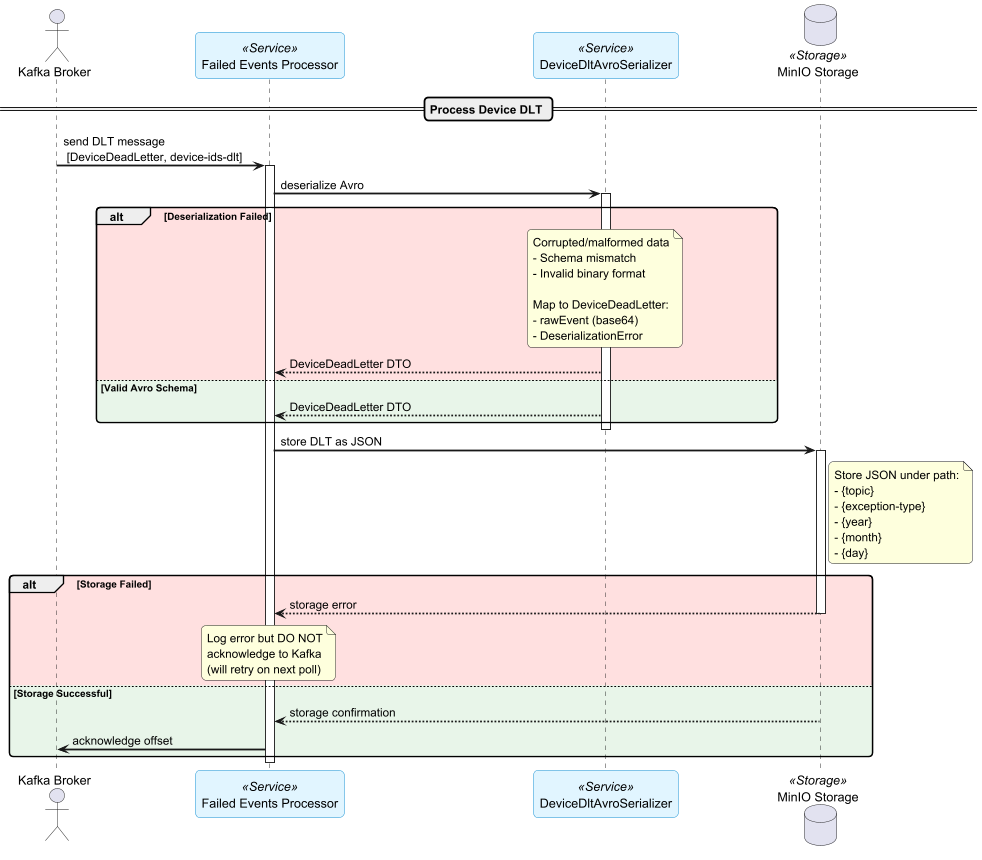

# Failed Events Processor

## Architecture Overview

Failed Events Processor is a microservice designed to handle and process events that have failed during their initial processing in a data pipeline. 
It listens to designated Kafka topics for failed events and stores them in an object storage for further analysis.

The service consists of the following components:

- **Data Storage**: MinIO
- **Messaging**: Kafka with Schema Registry
- **Observability**: Prometheus, Grafana

## Context Diagram



## Container Diagram



## Device Processing Flow



## Project Structure
```plaintext
failed-events-processor/
├── architecture/
│   ├── diagrams/                    # C4 diagrams
│   │   ├── image/                   # Images generated from PlantUML
│   │   ├── consume-device-flow.puml
│   │   ├── containers.puml
│   │   └── context.puml
│   └── src/main/
│       ├── java/
│       │   ├── api/                 # Service API (doesn't depend on any other layers)
│       │   │   ├── events/          # Application events
│       │   │   ├── exception/
│       │   │   ├── gateway/         # Gateway interfaces (data providers/consumers)
│       │   │   ├── model/           # Model classes
│       │   │   └── service/         # Business logic interfaces
│       │   ├── application/         # Business logic implementations
│       │   ├── kafka/               
│       │   ├── metrics/               
│       │   └── FailedEventsProcessorApplication.java
│       └── resources/
└── README.md
```

## Setup Instructions

### Prerequisites

- Git
- Docker
- Install Kafka plugin for your IDE (e.g., IntelliJ IDEA)
- Run Nexus (see README in root folder)
- (Optional) Switch to Linux terminal to run make commands if you're on Windows

### Starting the Platform

TODO: updated
To start local environment with Kafka and PostgreSQL, run:

```bash
cd ..
make start-env-device-collector
```

To start the Device Collector service, run:

```bash
cd ..
make start-device-collector
```

To start Device Collector with observability tools (Prometheus and Grafana), run:

```bash
cd ..
make start-device-collector observability
```

### Smoke Test

* Register device-ids-value (Device.avsc) and device-ids-dlt-value (DeviceDeadLetter.avsc) schemas in Schema Registry with Kafka plugin (see src/main/avro)
* Produce test messages to `device-ids` topic using Kafka plugin or any Kafka producer tool
```json
{
  "deviceId" : "\bRrIj/h\u0018hA,;",
  "deviceType" : {
    "string" : "\u0002\u0016= .@0j6b"
  },
  "createdAt" : {
    "long" : 8625999633872044475
  },
  "meta" : {
    "string" : "\u0002\u0016= .@0j6b"
  }
}
```

* Open Device Collector dashboard in [Grafana](http://localhost:3000/dashboards)
* Verify that "Number of successfully processed devices" is 1

### Plans

* Automate schema creation
* Implement hot sharding rebalancing